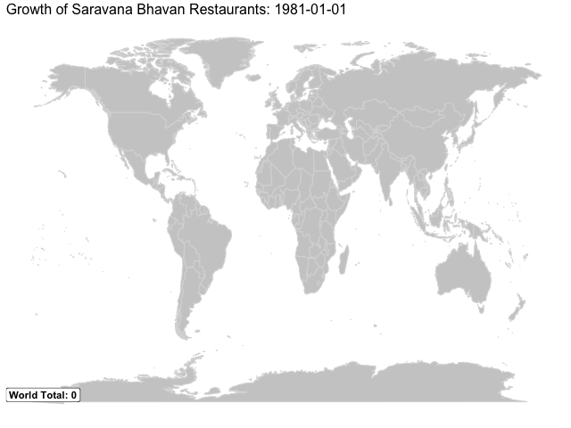
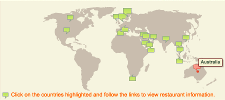
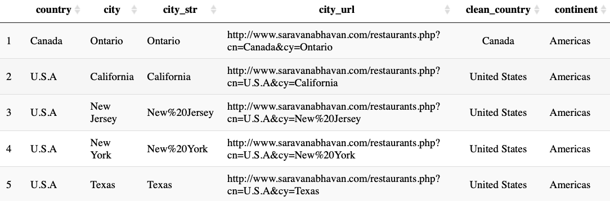
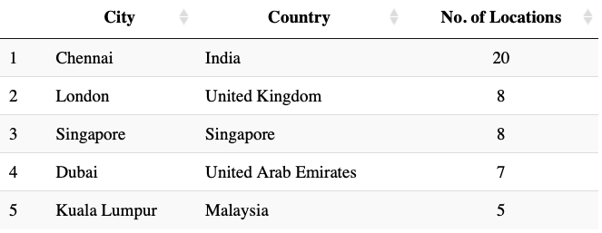
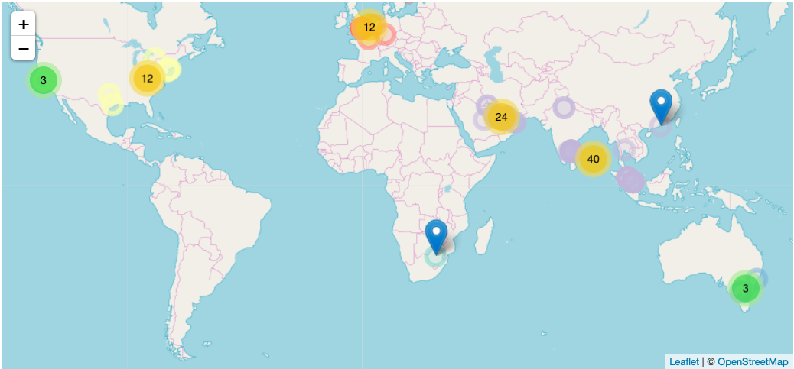
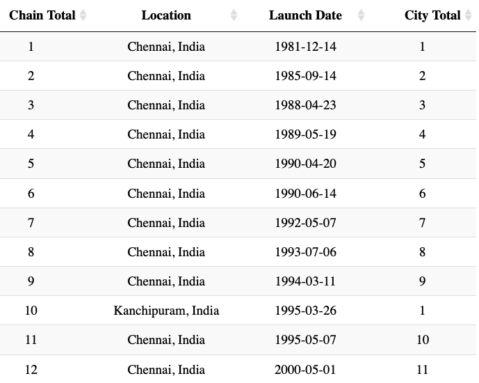
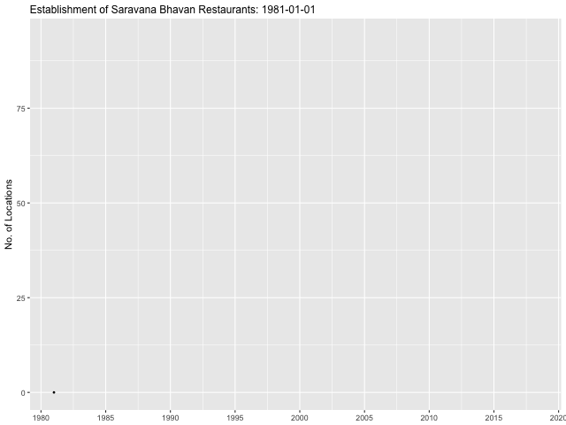

+++
title = "Animating Dosas"
subtitle = "Scraping Saravana Bhavan's web site to map restaurant locations in time and space"

date = 2018-05-31T00:00:00
lastmod = 2018-05-31T00:00:00
draft = false

# Authors. Comma separated list, e.g. `["Bob Smith", "David Jones"]`.
authors = [] # "Admin"

tags = ["gganimate", "leaflet", "tidyverse", "rvest"]
summary = "Scraping Saravana Bhavan's web site to map restaurant locations in time and space"

# Projects (optional).
#   Associate this post with one or more of your projects.
#   Simply enter your project's folder or file name without extension.
#   E.g. `projects = ["deep-learning"]` references
#   `content/project/deep-learning/index.md`.
#   Otherwise, set `projects = []`.
# projects = ["internal-project"]

# Featured image
# To use, add an image named `featured.jpg/png` to your project's folder.
[image]
  # Caption (optional)
  #caption = "Image credit: [**Unsplash**](https://unsplash.com/photos/CpkOjOcXdUY)"

  # Focal point (optional)
  # Options: Smart, Center, TopLeft, Top, TopRight, Left, Right, BottomLeft, Bottom, BottomRight
  focal_point = ""

  # Show image only in page previews?
  preview_only = true

+++

## Overview

From humble origins in Chennai, Saravana Bhavan has grown into a global chain of close to 100 high-quality, vegetarian South Indian restaurants. If you eat at their Delhi location, you'll find a paper placemat in front of you listing all of their locations around the world. I took the opportunity to scrape their company website for the addresses of these locations and map them.

This blog explains how I made a few different visualizations of the chain's growth, but here is my favorite.

<center>



</center>

I hope this map, along with a few others I've made below, are more informative than the map currently available on Saravana's website.

<center>



</center>

> *N.B. This post was written using the old `gganimate` API*

## Web Scraping

Rather than load all packages at once, I will load them as needed for easier demonstration. I used `rvest` for web scraping and the tidyverse for data wrangling.

```
library(tidyverse)
library(rvest)
library(countrycode)
library(ggmap)
```

### Scrape country pages

The first step was to scrape the data from the Saravana Bhavan [website](http://saravanabhavan.com/). To find the restaurant information, you need to enable Adobe Flash Player to see the map; then choose a country; then a city; and then pick a location. The complete urls contain a country ("cn"), a city ("cy"), and a restaurant id ("rid"). All of these will need to be scraped. An example of this pattern is "http://saravanabhavan.com/restaurants.php?cn=U.A.E&cy=Abu%20Dhabi&rid=73".

In order to do this, I first manually compiled a list of countries, noting their exact spelling and spacing. I then wrote a function to scrape the names of all cities for each country into a dataframe. I also mutated a few columns that will be necessary: 

* the names of cities with spaces replaced by "%20" for functioning urls

* the urls needed in the next step to scrape city pages

* and a clean version of country names for later plotting

Next, I loaded in some data from the `countrycode` package in order to pair each country with its continent. Later we can map this variable to color for some differentiation in our map.

```
# start with vector of countries exactly matching website
countries <- c("Canada", "U.S.A", "SouthAfrica", "Sweden", "Netherland", 
               "U.K", "Germany", "France", "SaudiArabia", "Bahrain", "Qatar",
               "U.A.E", "Kuwait", "Oman", "India", "Thailand", "HongKong",
               "Malaysia", "Singapore", "Australia")

# function to scrape country web pages for city names
scrape_country <- function(country) {
    
    url <- str_c("http://www.saravanabhavan.com/restaurants.php?cn=", country)
    city <- read_html(url) %>% 
        html_nodes(".arial-11-gray-bold-black") %>% 
        html_text() %>%
        .[!str_detect(., pattern = "Guest")]

    tibble(country = country, city = city)
}

# loop over country web pages to get df of countries and cities, plus complete urls
hsb <- countries %>%
    map_dfr(scrape_country) %>%
    mutate(
        city_str = str_replace(city, " ", "%20"),
        city_url = str_c("http://www.saravanabhavan.com/restaurants.php?cn=", 
                         country, "&cy=", city_str),
        clean_country = case_when(
            country == "U.S.A" ~ "United States",
            country == "U.K" ~ "United Kingdom",
            country == "SaudiArabia" ~ "Saudi Arabia",
            country == "HongKong" ~ "Hong Kong SAR China",
            country == "Netherland" ~ "Netherlands",
            country == "U.A.E" ~ "United Arab Emirates",
            country == "SouthAfrica" ~ "South Africa",
            TRUE ~ country
        )
    )

# get country-continent pair data from countrycode package for joining
data("codelist")
continents <- codelist %>%
    select(country.name.en, continent)

# fix country names and join with continents
hsb1 <- hsb %>%
    left_join(continents, by = c("clean_country" = "country.name.en"))

# output file after scraping
saveRDS(hsb1, file = "hsb1.rds")
```

We can see the results thus far here.




### Scrape city pages

After scraping the country pages for city names, we can scrape the city pages for their locations. We can write a very similar function but now target both the name of the location and its corresponding restaurant id ("rid").

```
# function to get locations and restaurant id from city page
get_location_rid <- function(city_url) {
    
    content <- read_html(city_url)
    
    location <- content %>%
        html_nodes("#branchDiv") %>% 
        html_text(trim = TRUE) %>%
        str_split("\n") %>%
        unlist() %>% 
        str_trim()
    
    rid <- content %>%    
        html_nodes(".arial-11-gray-bold-black") %>%
        html_attr("onclick") %>%
        str_subset("rid=") %>%
        word(start = -1, sep = "=") %>%
        word(start = 1, sep = "'")
    
    tibble(location, rid)
}

# add locations and rid to each city; mutate complete url for a location
hsb2 <- hsb1 %>%
    mutate(location_rid = purrr::map(.$city_url, get_location_rid)) %>%
    unnest() %>%
    mutate(rid_url = str_c(city_url, "&rid=", rid))

# output another file to avoid scraping again
saveRDS(hsb2, file = "hsb2.rds")
```

At this point we can look to see which cities and countries have the most locations. Chennai, where the chain started, is of course the clear leader but cities like London, Singapore and Dubai all have a very high number of locations. 



### Scrape location pages for addresses and launch dates

I repeated essentially the same process once more, now focused on extracting addresses and launch dates. For addresses, we have to do a bit of cleanup because we extracted more information than we need, such as phone numbers in most cases. These are not always formatted the same way for each page, but luckily address is always listed first. I have also made a few manual adjustments to addresses that are too brief to find a geolocation match. I also took the step of creating a variable for popup text to be displayed on the leaflet map.

```
# function to get address information from location page
get_address <- function(rid_url) {
    read_html(rid_url) %>%
        html_nodes(".arial-10-gray-bold .arial-10-gray-bold") %>% 
        html_text(trim = TRUE)
}

# add addresses for each location to dataframe
hsb <- hsb %>%
    mutate(address = purrr::map(.$rid_url, get_address)) %>%
    unnest() %>%
    filter(!address == "View Location Map")

# remove an erroneous duplicate row
hsb <- hsb[-c(36),]

# clean addresses by splitting on phone number in most cases
hsb <- hsb %>%
    separate(address, into = c("address", "extra"),
             sep = "Ph:|Ph :|Ph-|Ph -|PH -|Phone:|Tel:|Tel :|Tel  :|Tel /|Phone :|hsb.{1,}@saravanabhavan.com", remove = FALSE) %>% 
    mutate(address = str_remove(address, "\\.$"))

# make a few manual adjustments for failing addresses
hsb$address[hsb$location == "Vivo City"] <- str_c(
    hsb$address[hsb$location == "Vivo City"], ", Vivo City, Singapore")
hsb$address[hsb$location == "Bur Dubai"] <- str_c(
    hsb$address[hsb$location == "Bur Dubai"], ", Bur Dubai, Dubai")

# concatenate location and address in html for leaflet popups
hsb <- hsb %>%
    mutate(
        popup = str_c(
            "<b style='color: blue'>", location, "</b><br/>",
            address
        )
    )
```

We can follow the same process for dates. Only two locations are missing launch dates so that will not be a problem, and one of those restaurants missing a launch date looks to be closed anyway.

```
# function to get launch date information from location page
get_date <- function(rid_url) {
    
    launch_date <- read_html(rid_url) %>%
        html_nodes(".Arial-11-graybold") %>% 
        html_text(trim = TRUE) %>%
        str_split(": ") %>%
        unlist %>%
        .[2]
    
    launch_date <- ifelse(is.null(launch_date), NA, launch_date)
    return(launch_date)
}

# add addresses for each location to dataframe
hsb <- hsb %>%
    mutate(date = purrr::map_chr(.$rid_url, get_date),
           date = as.Date(date, format = "%d-%m-%Y")) 
```

## Geocoding locations

I used the `ggmap` package to find longitude and latitude coordinates for each location. Despite being well under a 2,500 query daily limit, I would receive many query limit errors in trying to extract this information, even when adding `Sys.sleep()` in between calls.

I was able to overcome this problem using a simplified version of a geocoding function from [Shane Lynn](https://www.shanelynn.ie/massive-geocoding-with-r-and-google-maps/). Three locations failed for reasons other than the query limit, and so I just looked them up manually. Be sure to output the object after geocoding completes so to avoid having to do it more than once.

```
# define function for getting coordinates of an address
get_geo <- function(address) {
    
    geo_reply <- geocode(address, output = 'all', 
                         messaging = TRUE, override_limit = TRUE)
    
    answer <- tibble(address = address, lat = NA, lon = NA, status = NA)
    answer$status <- geo_reply$status
    
    while (geo_reply$status == "OVER_QUERY_LIMIT") {
        print("OVER QUERY LIMIT - Pausing for 1 minute at:") 
        time <- Sys.time()
        print(as.character(time))
        Sys.sleep(60)
        geo_reply <- geocode(address, output = 'all', messaging = TRUE, override_limit = TRUE)
        answer$status <- geo_reply$status
    }
    
    if (geo_reply$status != "OK") {
        return(answer)
    }  else {
        answer$lat <- geo_reply$results[[1]]$geometry$location$lat
        answer$lon <- geo_reply$results[[1]]$geometry$location$lng
        return(answer)
    }
    
}

# get coordinates for each location's address in a new df after removing known failures
address_crs <- hsb %>%
    filter(!location %in% c("Southall", "Tooting", "Al Khuwair")) %>%
    .$address %>%
    map_dfr(get_geo)

# save to rds to avoid re-running geocode
saveRDS(address_crs, file = "address_crs.RDS")
```

Lastly, we just need to join the coordinate data back into our main dataset.

```
address_crs <- readRDS("address_crs.RDS")

# join coordinate data back into main df with 3 manual additions
final_hsb <- hsb %>%
    left_join(address_crs, by = "address") %>%
    mutate(
        lat = case_when(
            location == "Southall" ~ 51.5074321,
            location == "Tooting" ~ 51.4299496,
            location == "Al Khuwair" ~ 23.5968027,
            TRUE ~ lat
        ),
        lon = case_when(
            location == "Southall" ~ -0.3800047,
            location == "Tooting" ~ -0.1683871,
            location == "Al Khuwair" ~ 58.4314325,
            TRUE ~ lon
        )
    )

# save final df
saveRDS(final_hsb, "final_hsb.RDS")
```

## Plot locations on a Leaflet map

Once we have our final dataset we can plot the coordinates on a map. Leaflet is one tool we can use to do this easily. The map below has its pros and cons. It is very easy to interact with as we can zoom in to each cluster and get a better sense of the regional distribution. If we zoom in far enough, we can see exactly where each restaurant is. 

However, we are probably less interested in each restaurant's exact location. We could just use Google Maps if we were planning a visit. Instead a better choice might be animating a map that would allow for less interaction but would be able to show the growth of the franchise over time.



## Plot locations over time with gganimate

We will be able to tell a better story about the growth of the franchise if we utilize of the launch date variable. Moreover, instead of using exact locations, we can aggregate all locations in one city as a single entity. While we could repeat our geocoding process for city names, it makes more sense to use the coordinates of one of the locations previously found as the coordinates for all locations in that given city. On a world map, we will not be able to notice any intra-city differences anyway.

Launch dates were missing for only two restaurants, one of which appears now to be closed, so there is no problem there for our purposes. 

```
city_coordinates <- final_hsb %>%
    select(city, lat, lon) %>%
    group_by(city) %>%
    top_n(1)
    
# join coordinate data into df with dates of each location; mutate city totals, labels
hsb_dates <- final_hsb %>%
    filter(!is.na(date)) %>%
    select(city, clean_country, continent, date) %>%
    mutate(city_country = str_c(city, ", ", clean_country)) %>%
    left_join(city_coordinates, by = "city") %>%
    group_by(city_country, date, lat, lon, continent) %>%
    count() %>%
    arrange(date) %>%
    group_by(city_country, continent) %>%
    mutate(city_total = cumsum(n)) %>%
    ungroup() %>%
    mutate(
        hsb_total = cumsum(n),
        label = str_c(city_country, " (", city_total, ")")
    )
```

After the following transformations we can view the growth of the franchise in a table format. The first two decades of existence for the brand is almost exclusively in Chennai and South India.



Before animating, we can plot the final map with all locations.

```
library(maps)
library(ggthemes)

world <- ggplot() +
    borders("world", colour = "gray85", fill = "gray80") +
    theme_map()

world +
    geom_point(data = hsb_dates, 
               mapping = aes(x = lon, y = lat, size = city_total, color = continent), 
               alpha = 0.5) +
    scale_color_discrete(guide = FALSE) +
    labs(size = "No. Restaurants", 
         title = "Saravana Bhavan Restaurants Around the World") +
    theme(plot.title = element_text(size = 12))
```

The map above however fails to show the growth of the chain over time. That is something we can achieve with a simple animation. With a little guidance from a blog post by [Daniela Vázquez](https://d4tagirl.com/2017/05/how-to-plot-animated-maps-with-gganimate), it was fairly easy to make an animated map.

```
library(animation)
library(gganimate)

# add empty rows for 0 count at beginning and pause at finish
hsb_dates <- hsb_dates %>%
    add_row(date = as.Date("1981-01-01"), hsb_total = 0) %>%
    add_row(date = as.Date("2018-05-01"), hsb_total = 94) %>%
    arrange(date)

hsb_map <- world +
    geom_point(data = hsb_dates, mapping = aes(x = lon, y = lat, 
                      size = city_total, color = continent,
                      frame = date, cumulative = TRUE), 
               alpha = 0.5) +
    theme(legend.position = "none") +
    labs(size = "No. Restaurants", 
         title = "Growth of Saravana Bhavan Restaurants:") +
    ggrepel::geom_label_repel(
        data = hsb_dates,
        mapping = aes(x = lon, y = lat, label = label,
                      frame = date, cumulative = FALSE)
        ) +
    geom_label(data = hsb_dates,
               mapping = aes(label = str_c("World Total: ", hsb_total), frame = date,
                             x = -Inf, y = -88),
               size = 4, fontface = "bold", hjust = 0, vjust = 1, nudge_y = 10) +
    theme(plot.title = element_text(size = 16))

ani.options(ani.width = 640, ani.height = 480, interval = 0.8)
gganimate(hsb_map, filename = "hsb_map.gif")
```

<center>


</center>

## Plot growth over time

The animated map is excellent at showing the geographical distribution of the chain's growth. If instead we were more interested in the timeline of the growth, we could better represent the pace of the growth in a lineplot (shown below).

```
date_seq <- seq(from = as.Date("1980/1/1"), to = as.Date("2020/1/1"), by = "5 years")

ggplot(hsb_dates, aes(x = date, y = hsb_total)) +
    geom_point(size = 0.5) +
    geom_line() +
    scale_x_date(NULL, breaks = date_seq, date_labels = "%Y") +
    labs(title = "Establishment of Saravana Bhavan Restaurants",
         y = "No. of Locations") +
    theme(plot.title = element_text(size = 12))
```

We could then animate the line, adding the location name for each point.

```
hsb_time <- ggplot(hsb_dates, aes(x = date, y = hsb_total, frame = date)) +
    geom_point(size = 0.5) +
    geom_line(aes(cumulative = TRUE)) +
    ggrepel::geom_label_repel(aes(label = label), 
                              nudge_x = -5, nudge_y = 1, direction = "both") +
    scale_x_date(NULL, breaks = date_seq, date_labels = "%Y") +
    labs(title = "Establishment of Saravana Bhavan Restaurants:",
         y = "No. of Locations") +
    theme(plot.title = element_text(size = 12))

ani.options(ani.width = 640, ani.height = 480, interval = 0.8)
gganimate(hsb_time, filename = "hsb_time.gif")
```

<center>



</center>

## Conclusion

I hope these examples helped demonstrate the power of packages like `rvest` for webscraping, `leaflet` for html maps, and `gganimate` for animated plots. One possible improvement would be using `tweenr` to interpolate data between dates in order to smoothen out the transitions from point to point. The most interesting thing I noted about the chain's growth is the absolute paucity of branches in India, outside of Chennai. Eight locations in London but not a single one in Mumbai, Bangalore, Kolkata, Pune, Ahmedabad, etc? That seems quite odd.
