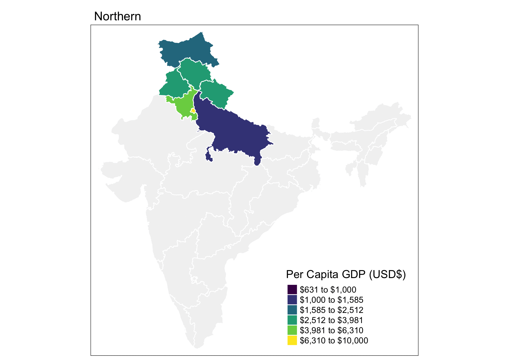

+++
title = "Animated and Interactive Maps in R"
subtitle = "Tutorial for creating animated maps using packages like `tmap` and `gganimate` and interactive maps using packages like `ggiraph`, `mapview`, `leaflet` and `plotly`."

date = 2019-01-30T00:00:00
lastmod = 2019-01-30T00:00:00
draft = false

# Authors. Comma separated list, e.g. `["Bob Smith", "David Jones"]`.
authors = []

tags = ["tmap", "sf", "gganimate", "mapview", "leaflet", "plotly", "ggiraph", "crosstalk", "shiny"]
summary = "Tutorial for creating animated maps using packages like `tmap` and `gganimate` and interactive maps using packages like `ggiraph`, `mapview`, `leaflet` and `plotly`."

# Projects (optional).
#   Associate this post with one or more of your projects.
#   Simply enter your project's folder or file name without extension.
#   E.g. `projects = ["deep-learning"]` references 
#   `content/project/deep-learning/index.md`.
#   Otherwise, set `projects = []`.
# projects = ["internal-project"]

# Featured image
# To use, add an image named `featured.jpg/png` to your project's folder. 
[image]
  # Caption (optional)
  #caption = "Image credit: [**Unsplash**](https://unsplash.com/photos/CpkOjOcXdUY)"

  # Focal point (optional)
  # Options: Smart, Center, TopLeft, Top, TopRight, Left, Right, BottomLeft, Bottom, BottomRight
  focal_point = "Smart"

  # Show image only in page previews?
  preview_only = true

+++

In support of the Social Cops [Introduction to GIS in R](https://socialcops.com/courses/introduction-to-gis-r/) free online course, I wrote this lesson on creating animated and interactive maps in R. Find it at the link below:

**https://socialcops.com/courses/introduction-to-gis-r/lesson4-animated-interactive-maps/**

It includes many examples like this:

*Source: Social Cops Introduction to GIS in R course*
