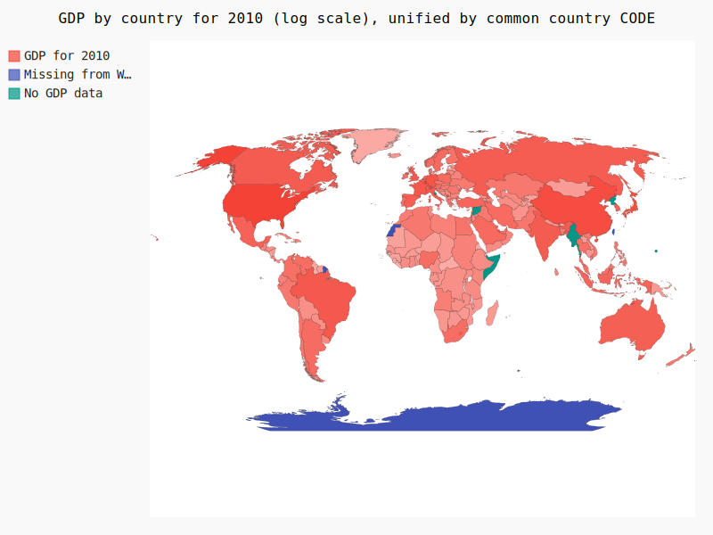
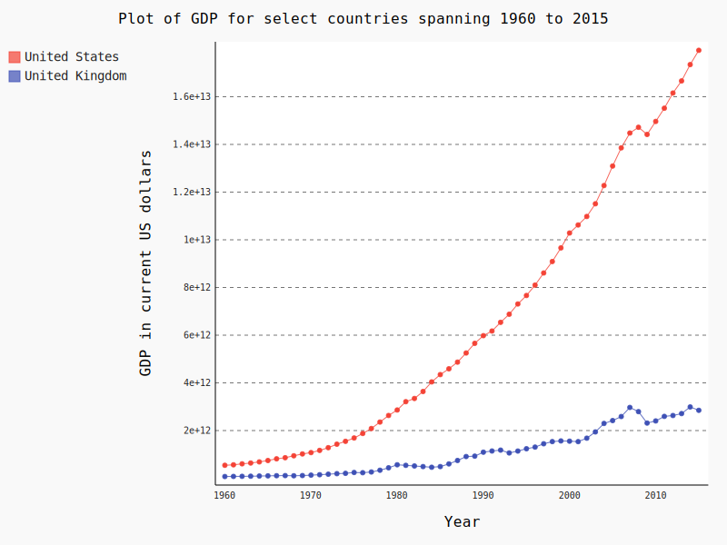

+++
title = "Plotting with Pygal"
subtitle = "An introduction to Python’s Pygal plotting library"

date = 2018-08-09T00:00:00
lastmod = 2018-08-09T00:00:00
draft = false

# Authors. Comma separated list, e.g. `["Bob Smith", "David Jones"]`.
authors = [] # "Admin"

tags = ["python"]
summary = "An introduction to Python’s Pygal plotting library"

# Projects (optional).
#   Associate this post with one or more of your projects.
#   Simply enter your project's folder or file name without extension.
#   E.g. `projects = ["deep-learning"]` references 
#   `content/project/deep-learning/index.md`.
#   Otherwise, set `projects = []`.
# projects = ["internal-project"]

# Featured image
# To use, add an image named `featured.jpg/png` to your project's folder. 
[image]
  # Caption (optional)
  #caption = "Image credit: [**Unsplash**](https://unsplash.com/photos/CpkOjOcXdUY)"

  # Focal point (optional)
  # Options: Smart, Center, TopLeft, Top, TopRight, Left, Right, BottomLeft, Bottom, BottomRight
  focal_point = ""

  # Show image only in page previews?
  preview_only = true

+++

In order to brush up on my Python skills, I recently completed the [Introduction to Python Scripting Specialization](https://www.coursera.org/specializations/introduction-scripting-in-python) on Coursera from Rice University. Four brief courses introduce Python Programming Essentials, Data Representations, Data Analysis and Data Visualization.

The specialization requires writing short Python scripts of a few specified functions, each assessed by a machine grader. The final projects in the Data Visualization course introduce the Pygal plotting library.

One of these projects requires unifying World Bank GDP data with Pygal country codes in order to construct a world choropleth for a given year. Below is one example plot output. Although the built-in tooltips are nice, the default color palette makes it difficult to easily distinguish differences in GDP values, even after converting to a log scale.

The penultimate project required constructing line plots of World Bank GDP data for a given selection of countries, again using the Pygal plotting library.

My scripts for producing these plots can be found in my [GitHub repo](https://github.com/seanangio/rice_isp).

While these scripts recreated the required visualizations, they should not be considered publication-ready. In the map for instance, the legend categorizes the differences between countries having GDP data and those missing, but there is no explanation of what the shades of red represent. The “Missing from World Bank Data” label is also cut-off. Moreover, the tooltips give GDP values with too many decimal points but no sense of units. It also does not utilize space well. The legend could likely fit in the bottom left corner closer to South America, and there could be less space between the title and the map itself.

The line plot also suffers from poor formatting of numeric values in the tooltip and y-axis. Placing the legend on the right hand side (`ggplot2`’s default) would also make better use of space.
