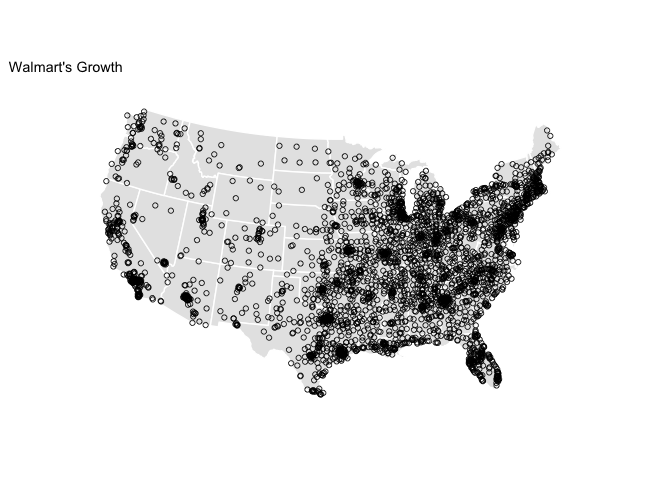
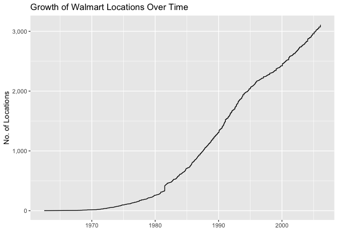
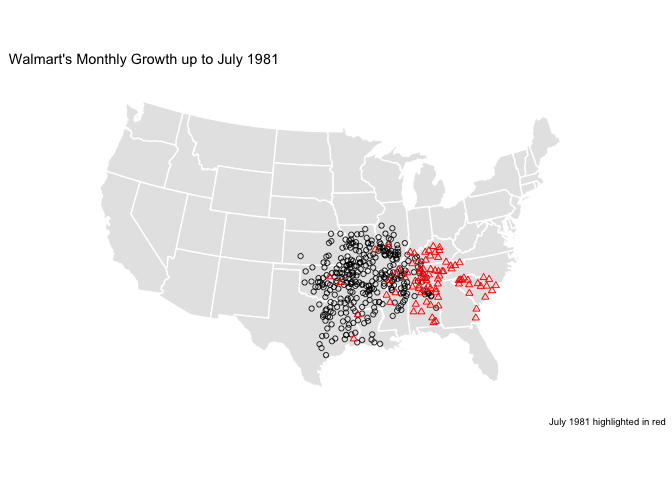
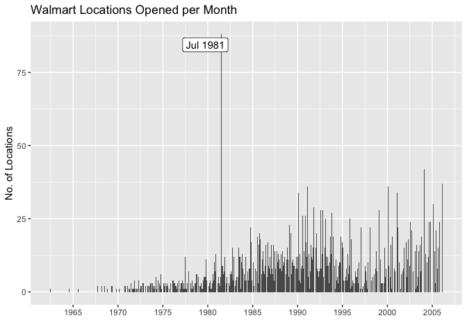

+++
title = "Mapping Walmart’s Growth"
subtitle = "Recreating a D3 visualization of Walmart’s US growth in R with `gganimate`"

date = 2018-06-21T00:00:00
lastmod = 2018-06-21T00:00:00
draft = false

# Authors. Comma separated list, e.g. `["Bob Smith", "David Jones"]`.
authors = []

tags = ["gganimate"]
summary = "Recreating a D3 visualization of Walmart’s US growth in R with `gganimate`"

# Projects (optional).
#   Associate this post with one or more of your projects.
#   Simply enter your project's folder or file name without extension.
#   E.g. `projects = ["deep-learning"]` references 
#   `content/project/deep-learning/index.md`.
#   Otherwise, set `projects = []`.
# projects = ["internal-project"]

# Featured image
# To use, add an image named `featured.jpg/png` to your project's folder. 
[image]
  # Caption (optional)
  #caption = "Image credit: [**Unsplash**](https://unsplash.com/photos/CpkOjOcXdUY)"

  # Focal point (optional)
  # Options: Smart, Center, TopLeft, Top, TopRight, Left, Right, BottomLeft, Bottom, BottomRight
  focal_point = "Right"

  # Show image only in page previews?
  preview_only = true

+++

### Summary

Mike Bostock recently posted a D3 visualization of the growth of Walmart locations in the US. I wanted to recreate it in R, animating it with the `gganimate` package, and do a brief investigation.

> *N.B.: This post was created with the original `gganimate` API.*

### Reading in the Data

The original D3 visualization can be found [here](https://beta.observablehq.com/@mbostock/walmarts-growth), and the original data he used comes from [here](http://users.econ.umn.edu/~holmes/data/WalMart/index.html).

```
library(tidyverse)

data <- "https://gist.githubusercontent.com/mbostock/4330486/raw/fe47cd0f43281cae3283a5b397f8f0118262bf55/walmart.tsv"

walmart <- read_csv2(data) %>%
    separate(col = "0\t1\tdate", into = c("lon", "lat", "estab"), sep = "\t") %>%
    mutate(
        lon = as.numeric(lon),
        lat = as.numeric(lat),
        estab = lubridate::mdy(estab)
    ) %>%
    arrange(estab) %>%
    rowid_to_column("number")
```

### First Plot

After reading in the data, we can make a first plot of all locations with the correct map projection.

```
library(maps)
library(ggthemes)
states <- map_data("state")

ggplot() +
    geom_polygon(data = states, aes(x = long, y = lat, group = group),
                 fill = "grey90", color = "white") +
    coord_map("albers", lat0 = 39, lat1 = 45) +
    geom_point(data = walmart, aes(x = lon, y = lat), 
               size = 1.5, alpha = 0.8, shape = 1) +
    theme_map() +
    ggtitle("Walmart's Growth")
```



### First Animation

Now that we have a plot that looks quite similar to the final graphic, let’s animate it using the `gganimate` package. To plot current points in the animation in red, I just plotted the data twice, in one case setting the aesthetic `cumulative = TRUE` and in the other `cumulative = FALSE`. We can save the output as a gif.

```
library(animation)
library(gganimate)

wal_ani <- ggplot() +
    geom_polygon(data = states, aes(x = long, y = lat, group = group),
                 fill = "grey90", color = "white") +
    coord_map("albers", lat0 = 39, lat1 = 45) +
    theme_map() +
    # plot first location
    geom_point(data = filter(walmart, number == 1), 
               aes(x = lon, y = lat), color = "blue", size = 1.5) +
    # plot all others
    geom_point(data = filter(walmart, number != 1),
               aes(x = lon, y = lat, frame = estab, cumulative = TRUE), 
               size = 1.5, alpha = 0.8, shape = 1) +
    # plot red point when added
    geom_point(data = filter(walmart, number != 1),
               aes(x = lon, y = lat, frame = estab, cumulative = FALSE), 
               size = 1.5, color = "red") +
    ggtitle("Walmart's Growth")

ani.options(ani.width = 1280, ani.height = 720, interval = 0.1)
gganimate(wal_ani, filename = "walmart.gif")
```


It is interesting to note the strong clustering of locations near the original establishment in Arkansas. Rather than spreading geographically wide, the approach to expansion definitely seems to favor a more gradual regional growth expanding from the origin.

### Line Plot

A downside of this style of animation is that it can be difficult to discern the pace of the growth. As the plot below shows, it is hardly linear.

```
ggplot(walmart, aes(x = estab, y = number)) + 
    geom_line() +
    scale_y_continuous("No. of Locations", labels = scales::comma) +
    scale_x_date("") +
    ggtitle("Growth of Walmart Locations Over Time")
```



### Monthly Growth Animation

I can try to account for this in the animation by rounding dates to the nearest month and adding any empty months to the dataset.

```
library(lubridate)
walmart <- walmart %>% 
    mutate(rdate = round_date(estab, unit = "month")) 

# join in empty months
walmart_mon <- walmart %>%
    right_join(
        as_tibble(seq(min(walmart$rdate), max(walmart$rdate), by = 'month')),
        by = c("rdate" = "value")
    ) %>%
    mutate(
        lon = ifelse(is.na(lon), 0, lon),
        lat = ifelse(is.na(lat), 0, lat)
        )
```

Now the animation below shows monthly growth, which gives a slightly better impression of the time dimension of the growth.

```
wal_ani_mon <- ggplot() +
    geom_polygon(data = states, aes(x = long, y = lat, group = group),
                 fill = "grey90", color = "white") +
    coord_map("albers", lat0 = 39, lat1 = 45) +
    theme_map() +
    # plot first location
    geom_point(data = filter(walmart_mon, number == 1), 
               aes(x = lon, y = lat), color = "blue", size = 1.5) +
    # plot all others
    geom_point(data = filter(walmart_mon, number != 1),
               aes(x = lon, y = lat, frame = rdate, cumulative = TRUE), 
               size = 1.5, alpha = 0.8, shape = 1) +
    # plot red point when added
    geom_point(data = filter(walmart_mon, number != 1),
               aes(x = lon, y = lat, frame = rdate, cumulative = FALSE), 
               size = 1.5, color = "red") +
    ggtitle("Walmart's Monthly Growth")

ani.options(ani.width = 1280, ani.height = 720, interval = 0.1)
gganimate(wal_ani_mon, filename = "walmart_mon.gif")
```


### Investigating High Months

In the monthly animation, you will notice one especially large flash where a substantial number of locations opened in a single month. In the table below, we can see the months with the greatest number of new locations opening.

| Date       | Locations Opened |
| -----------| -----------------|
| July 1981  | 88               |
| Feb 2004   | 42               |
| Feb 2006   | 37               |
| Feb 1991   | 36               |
| Feb 2001   | 36               |

Did 88 new Walmarts open in July 1981 alone? If we plot Walmart’s growth up to this point, and mark these locations in red, we can see that this month would have been a really big month for the company, particularly making inroads east of Arkansas.

```
ggplot() +
    geom_polygon(data = states, aes(x = long, y = lat, group = group),
                 fill = "grey90", color = "white") +
    coord_map("albers", lat0 = 39, lat1 = 45) +
    geom_point(data = filter(walmart, rdate < as.Date("1981-07-01")), 
               aes(x = lon, y = lat), 
               size = 1.5, alpha = 0.8, shape = 1) +
    geom_point(data = filter(walmart, rdate == as.Date("1981-07-01")), 
               aes(x = lon, y = lat), 
               size = 1.5, color = "red", shape = 2) +
    theme_map() +
    labs(title = "Walmart's Monthly Growth up to July 1981", 
         caption = "July 1981 highlighted in red")
```



However, more realistically, this is likely an error in the data. As seen in the plot below, it is such a huge outlier (more than double the next highest month) that a simple error seems to be the most likely explanation.

```
mon_counts <- walmart %>%
    count(rdate) 

mon_counts %>%
    ggplot(aes(x = rdate, y = n)) + 
    geom_col() +
    scale_y_continuous("No. of Locations") +
    scale_x_date("", breaks = seq(as.Date("1965-01-01"), as.Date("2005-01-01"), by = "5 years"), labels = scales::date_format("%Y")) +
    ggrepel::geom_label_repel(
        data = filter(mon_counts, rdate == as.Date("1981-07-01")),
        aes(label = format(rdate, "%b %Y"))
    ) +
    ggtitle("Walmart Locations Opened per Month")
```


For further reference, find this post's Github [repository](https://github.com/seanangio/walmart).
