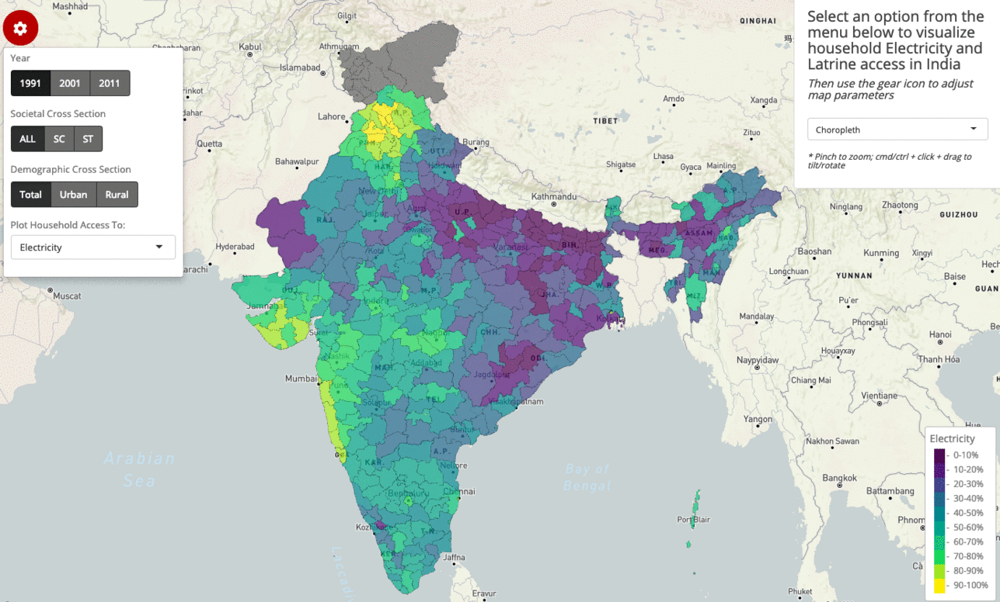
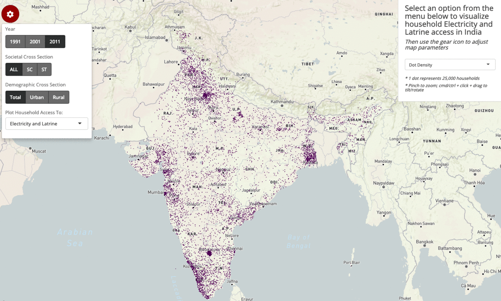
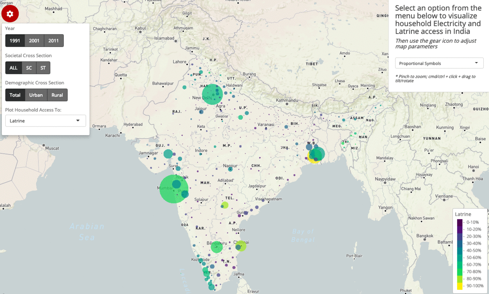
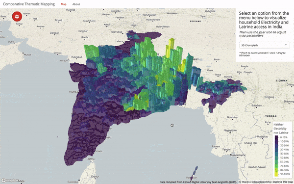

+++
# Project title.
title = "Comparative Thematic Mapping with Mapdeck"

# Date this page was created.
date = 2019-03-25T00:00:00

# Project summary to display on homepage.
summary = "Compare mapping styles like a choropleth, dot density map, proportional symbols map, and 3D choropleth using Indian electricity and latrine access data"

# Tags: can be used for filtering projects.
# Example: `tags = ["machine-learning", "deep-learning"]`
tags = ["sf", "mapdeck", "shiny"]

# Optional external URL for project (replaces project detail page).
external_link = ""

# Slides (optional).
#   Associate this project with Markdown slides.
#   Simply enter your slide deck's filename without extension.
#   E.g. `slides = "example-slides"` references 
#   `content/slides/example-slides.md`.
#   Otherwise, set `slides = ""`.
#slides = "example-slides"

# Links (optional).
url_pdf = ""
url_slides = ""
url_code = ""
url_custom = [{name = "App", url = "https://seanangio.shinyapps.io/thematic_mapping/"},
              {name = "GitHub", url = "https://github.com/seanangio/in_household"}]

# Custom links (optional).
#   Uncomment line below to enable. For multiple links, use the form `[{...}, {...}, {...}]`.
#url_custom = [{icon_pack = "fab", icon="twitter", name="Follow", url = "https://twitter.com/georgecushen"}]

# Featured image
# To use, add an image named `featured.jpg/png` to your project's folder. 
[image]
  # Caption (optional)
  #caption = "Photo by rawpixel on Unsplash"
  
  # Focal point (optional)
  # Options: Smart, Center, TopLeft, Top, TopRight, Left, Right, BottomLeft, Bottom, BottomRight
  focal_point = "Smart"
  
  # Show image only in page previews?
  preview_only = true
+++

The app linked below uses the {mapdeck} library to compare common thematic mapping styles using Indian electricity and latrine access data. These styles include a choropleth, a dot density map, a proportional symbols map, and a 3D choropleth.

**https://seanangio.shinyapps.io/thematic_mapping/**

A choropleth gives the simplest view of the spatial distribution of a standardized rate, but conceals the vastly-different underlying population counts.

##### Choropleth of Indian household electricity access (1991-2011)

A dot density map provides a method to spatially visualize clusters of a raw count, while sacrificing the ability to retrieve numeric data.

##### Dot density map comparing urban and rural households having access to both electricity and latrines (2011)

A proportional symbols map can communicate both a standardized rate and a raw count through the color and size aesthetics, yet congestion is often a dilemma.

##### Proportional symbols map depicting household latrine access (1991-2011)

A 3D choropleth can map a rate and a raw count, while preserving the original geographic shapes, but at the cost of visual clarity.

##### 2011 households having access to neither electricity nor a latrine

