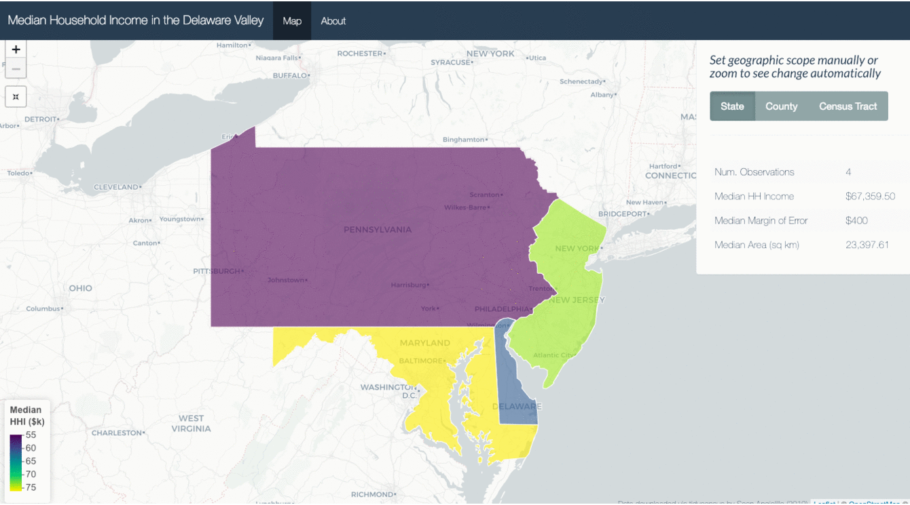

+++
# Project title.
title = "Zoom-Triggered Actions in Leaflet and Shiny"

# Date this page was created.
date = 2018-12-13T00:00:00

# Project summary to display on homepage.
summary = "Explore median household income data in the Delaware Valley at various levels of scope"

# Tags: can be used for filtering projects.
# Example: `tags = ["machine-learning", "deep-learning"]`
tags = ["sf", "leaflet", "shiny", "ggplot2", "tigris", "tidycensus"]

# Optional external URL for project (replaces project detail page).
external_link = ""

# Slides (optional).
#   Associate this project with Markdown slides.
#   Simply enter your slide deck's filename without extension.
#   E.g. `slides = "example-slides"` references 
#   `content/slides/example-slides.md`.
#   Otherwise, set `slides = ""`.
#slides = "example-slides"

# Links (optional).
url_pdf = ""
url_slides = ""
url_video = ""
url_code = ""
url_custom = [{name = "App", url = "https://seanangio.shinyapps.io/dv_income"},
              {name = "GitHub", url = "https://github.com/seanangio/dv_income"}]

# Custom links (optional).
#   Uncomment line below to enable. For multiple links, use the form `[{...}, {...}, {...}]`.
#url_custom = [{icon_pack = "fab", icon="twitter", name="Follow", url = "https://twitter.com/georgecushen"}]

# Featured image
# To use, add an image named `featured.jpg/png` to your project's folder. 
[image]
  # Caption (optional)
  #caption = "Photo by rawpixel on Unsplash"
  
  # Focal point (optional)
  # Options: Smart, Center, TopLeft, Top, TopRight, Left, Right, BottomLeft, Bottom, BottomRight
  focal_point = "Smart"
  
  # Show image only in page previews?
  preview_only = true
+++

This is a simple project demonstrating how to trigger actions in Shiny-Leaflet projects using the zoom level. Given a zoom level, the map displays the corresponding state, county or census tract shapes. Find the app at the button above or link below.

**https://seanangio.shinyapps.io/dv_income/**

