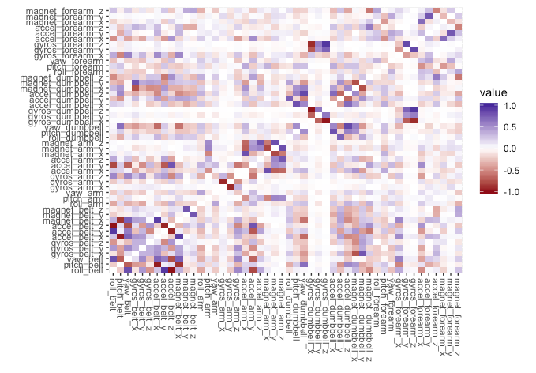

+++
# Project title.
title = "Supervised Learning: Exercise Classification"

# Date this page was created.
date = 2017-12-17T00:00:00

# Project summary to display on homepage.
summary = "Exploring the effectiveness of different ML models to classify motion data into exercise categories"

# Tags: can be used for filtering projects.
# Example: `tags = ["machine-learning", "deep-learning"]`
tags = ["caret", "ML"]

# Optional external URL for project (replaces project detail page).
external_link = ""

# Slides (optional).
#   Associate this project with Markdown slides.
#   Simply enter your slide deck's filename without extension.
#   E.g. `slides = "example-slides"` references 
#   `content/slides/example-slides.md`.
#   Otherwise, set `slides = ""`.
#slides = "example-slides"

# Links (optional).
url_pdf = ""
url_slides = ""
url_video = ""
url_code = ""
url_custom = [{name = "Report", url = "https://rpubs.com/seanangio/exercises_classification"},
              {name = "GitHub", url = "https://github.com/seanangio/JHU_Data_Science/8_Practical_Machine_Learning/"}]

# Custom links (optional).
#   Uncomment line below to enable. For multiple links, use the form `[{...}, {...}, {...}]`.
#url_custom = [{icon_pack = "fab", icon="twitter", name="Follow", url = "https://twitter.com/georgecushen"}]

# Featured image
# To use, add an image named `featured.jpg/png` to your project's folder. 
[image]
  # Caption (optional)
  #caption = "Photo by rawpixel on Unsplash"
  
  # Focal point (optional)
  # Options: Smart, Center, TopLeft, Top, TopRight, Left, Right, BottomLeft, Bottom, BottomRight
  focal_point = "Smart"
  
  # Show image only in page previews?
  preview_only = true
+++

The final project for the Practical Machine Learning course of the Data Science Specialization on Coursera from Johns Hopkins University is to use supervised learning techniques to classify repetitions of physical exercises based on the manner in which the motion was completed using accelerometer, gyroscope and magnetometer data. 

**https://rpubs.com/seanangio/exercises_classification**

