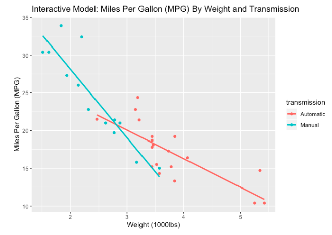

+++
# Project title.
title = "Comparing Fuel Efficiency via Linear Regression"

# Date this page was created.
date = 2017-11-23T00:00:00

# Project summary to display on homepage.
summary = "Using linear regression models to quantify the difference in fuel efficiency among automatic and manual transmission cars"

# Tags: can be used for filtering projects.
# Example: `tags = ["machine-learning", "deep-learning"]`
tags = ["regression", "mtcars"]

# Optional external URL for project (replaces project detail page).
external_link = ""

# Slides (optional).
#   Associate this project with Markdown slides.
#   Simply enter your slide deck's filename without extension.
#   E.g. `slides = "example-slides"` references 
#   `content/slides/example-slides.md`.
#   Otherwise, set `slides = ""`.
#slides = "example-slides"

# Links (optional).
url_pdf = ""
url_slides = ""
url_video = ""
url_code = ""
url_custom = [{name = "Report", url = "https://rpubs.com/seanangio/mtcars"},
              {name = "GitHub", url = "https://github.com/seanangio/JHU_Data_Science/tree/master/7_Regression_Models"}]

# Custom links (optional).
#   Uncomment line below to enable. For multiple links, use the form `[{...}, {...}, {...}]`.
#url_custom = [{icon_pack = "fab", icon="twitter", name="Follow", url = "https://twitter.com/georgecushen"}]

# Featured image
# To use, add an image named `featured.jpg/png` to your project's folder. 
[image]
  # Caption (optional)
  #caption = "Photo by rawpixel on Unsplash"
  
  # Focal point (optional)
  # Options: Smart, Center, TopLeft, Top, TopRight, Left, Right, BottomLeft, Bottom, BottomRight
  focal_point = "Smart"
  
  # Show image only in page previews?
  preview_only = true
+++

The final project for the Linear Regression course of the Data Science Specialization on Coursera from Johns Hopkins University is to assess whether cars with a manual transmission have better fuel efficiency than those with an automatic transmission using only linear regression techniques. The report below attempts to quantify this difference using a variety of linear models.

**https://rpubs.com/seanangio/mtcars**

