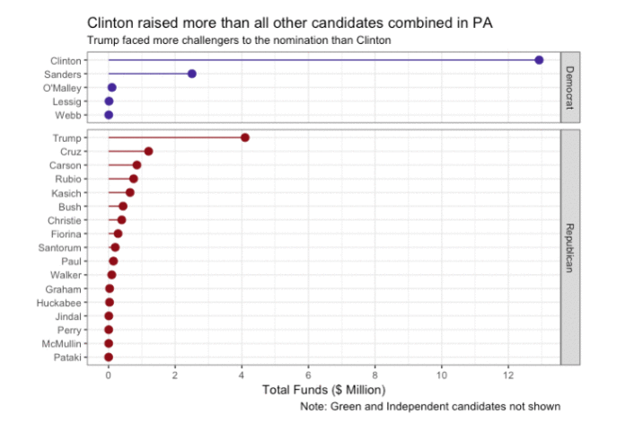

+++
# Project title.
title = "Exploratory Data Analysis"

# Date this page was created.
date = 2018-05-18T00:00:00

# Project summary to display on homepage.
summary = "Investigation and visualization of 2016 Presidential election campaign contributions in PA"

# Tags: can be used for filtering projects.
# Example: `tags = ["machine-learning", "deep-learning"]`
tags = ["tidyverse", "ggiraph"]

# Optional external URL for project (replaces project detail page).
external_link = ""

# Slides (optional).
#   Associate this project with Markdown slides.
#   Simply enter your slide deck's filename without extension.
#   E.g. `slides = "example-slides"` references 
#   `content/slides/example-slides.md`.
#   Otherwise, set `slides = ""`.
#slides = "example-slides"

# Links (optional).
url_pdf = ""
url_slides = ""
url_video = ""
url_code = ""
url_custom = [{name = "Report", url = "https://rpubs.com/seanangio/PA2016"},
              {name = "GitHub", url = "https://github.com/seanangio/PA2016"}]

# Custom links (optional).
#   Uncomment line below to enable. For multiple links, use the form `[{...}, {...}, {...}]`.
#url_custom = [{icon_pack = "fab", icon="twitter", name="Follow", url = "https://twitter.com/georgecushen"}]

# Featured image
# To use, add an image named `featured.jpg/png` to your project's folder. 
[image]
  # Caption (optional)
  #caption = "Photo by rawpixel on Unsplash"
  
  # Focal point (optional)
  # Options: Smart, Center, TopLeft, Top, TopRight, Left, Right, BottomLeft, Bottom, BottomRight
  focal_point = "Center"
  
  # Show image only in page previews?
  preview_only = true
+++

Following completion of Udacity's [Data Analysis with R course](https://in.udacity.com/course/data-analysis-with-r--ud651), I conducted an exploratory data analysis of 2016 Presidential campaign contribution data from the state of Pennsylvania. Find it at the "Report" button above or link below:

**https://rpubs.com/seanangio/PA2016**

