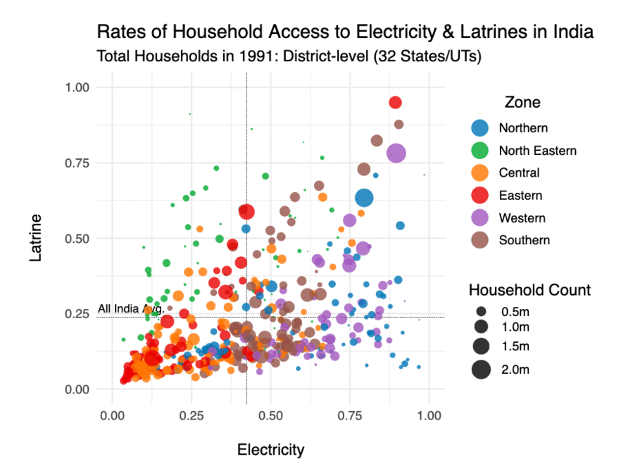
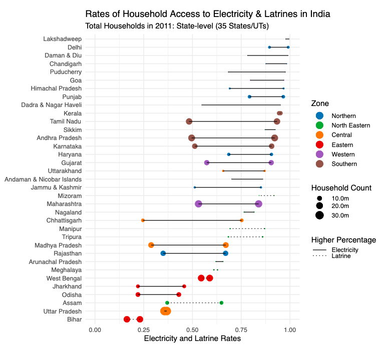
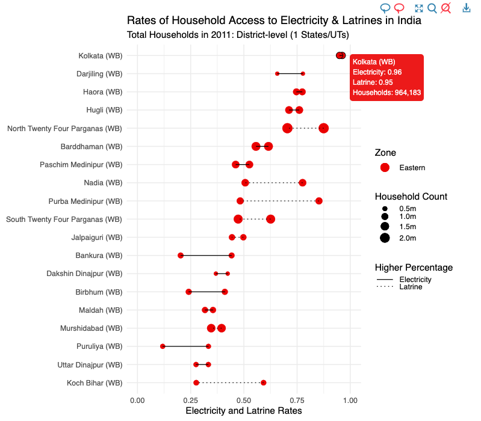
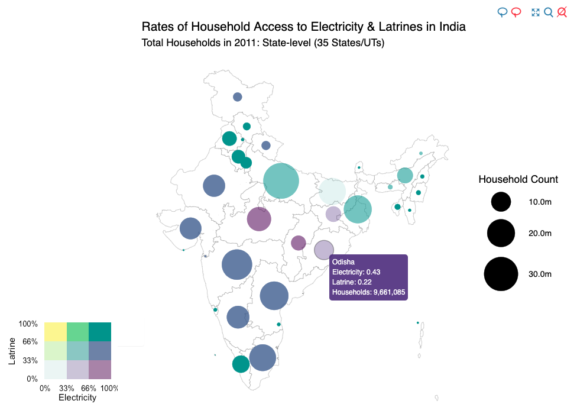
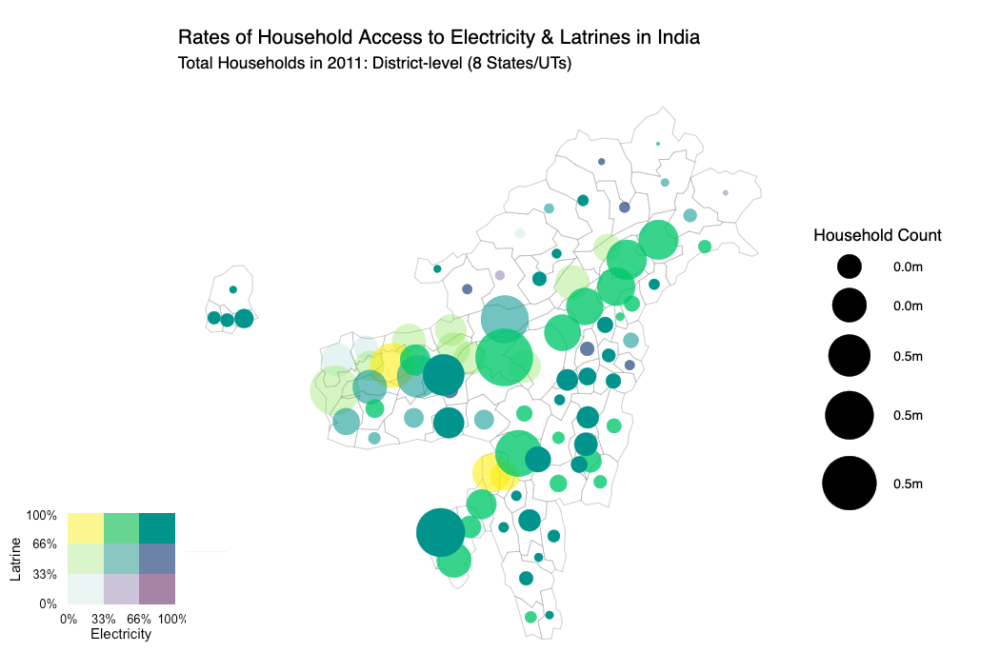

+++
# Project title.
title = "Dashboards with shinydashboard & ggiraph"

# Date this page was created.
date = 2019-05-09T00:00:00

# Project summary to display on homepage.
summary = "Explore how access to electricity in India varies with respect to latrine access at state and district levels through a scatterplot, dumbbell plot and a bivariate bubble map"

# Tags: can be used for filtering projects.
# Example: `tags = ["machine-learning", "deep-learning"]`
tags = ["shiny", "shinydashboard", "sf", "ggiraph"]

# Optional external URL for project (replaces project detail page).
external_link = ""

# Slides (optional).
#   Associate this project with Markdown slides.
#   Simply enter your slide deck's filename without extension.
#   E.g. `slides = "example-slides"` references 
#   `content/slides/example-slides.md`.
#   Otherwise, set `slides = ""`.
#slides = "example-slides"

# Links (optional).
url_pdf = ""
url_slides = ""
url_code = ""
url_custom = [{name = "App", url = "https://seanangio.shinyapps.io/shinydash/"},
              {name = "GitHub", url = "https://github.com/seanangio/in_household/tree/master/shinydash"}]

# Custom links (optional).
#   Uncomment line below to enable. For multiple links, use the form `[{...}, {...}, {...}]`.
#url_custom = [{icon_pack = "fab", icon="twitter", name="Follow", url = "https://twitter.com/georgecushen"}]

# Featured image
# To use, add an image named `featured.jpg/png` to your project's folder. 
[image]
  # Caption (optional)
  #caption = "Photo by rawpixel on Unsplash"
  
  # Focal point (optional)
  # Options: Smart, Center, TopLeft, Top, TopRight, Left, Right, BottomLeft, Bottom, BottomRight
  focal_point = "Smart"
  
  # Show image only in page previews?
  preview_only = true
+++

The app linked below uses the {shinydashboard} and {ggiraph} packages to create an interactive visualization of Indian electricity and latrine access data. 

**https://seanangio.shinyapps.io/shinydash/**

It seeks to shed light on the question of how access to electricity and latrines vary with respect to each other. How do these metrics vary over time? Across different societal groups? Among urban vs. rural households? At state and district levels? In particular geographic regions?

The vastly uneven population counts across states and districts led me to choose visualizations that allow population to be mapped to a size aesthetic, specifically a scatterplot, a dumbbell plot, and a bivariate choropleth. Of course, each has their own particular strengths and weaknesses.

#### District-level scatterplot across time

#### Dumbbell plots

Shown at the state level

Or choose an individual state

#### Bivariate Bubble Map

At the state level

Or a particular region

