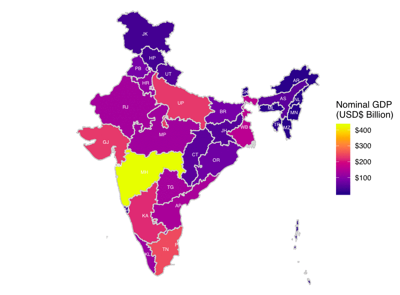

+++
# Project title.
title = "Generate Choropleths and Cartograms in Shiny"

# Date this page was created.
date = 2018-08-31T00:00:00

# Project summary to display on homepage.
summary = "Visualize India's states through a range of geospatial representations"

# Tags: can be used for filtering projects.
# Example: `tags = ["machine-learning", "deep-learning"]`
tags = ["sf", "ggiraph", "shiny", "cartogram", "geogrid"]

# Optional external URL for project (replaces project detail page).
external_link = ""

# Slides (optional).
#   Associate this project with Markdown slides.
#   Simply enter your slide deck's filename without extension.
#   E.g. `slides = "example-slides"` references 
#   `content/slides/example-slides.md`.
#   Otherwise, set `slides = ""`.
#slides = "example-slides"

# Links (optional).
url_pdf = ""
url_slides = ""
url_video = ""
url_code = ""

url_custom = [{name = "App", url = "https://shiny.socialcops.com/indiastates/"},
              {name = "Blog", url = "https://socialcops.com/courses/introduction-to-gis-r/lesson4-animated-interactive-maps/"},
              {name = "GitHub", url = "https://github.com/seanangio/viz_india"}]

# Custom links (optional).
#   Uncomment line below to enable. For multiple links, use the form `[{...}, {...}, {...}]`.
#url_custom = [{icon_pack = "fab", icon="twitter", name="Follow", url = "https://twitter.com/georgecushen"}]

# Featured image
# To use, add an image named `featured.jpg/png` to your project's folder. 
[image]
  # Caption (optional)
  #caption = "Photo by rawpixel on Unsplash"
  
  # Focal point (optional)
  # Options: Smart, Center, TopLeft, Top, TopRight, Left, Right, BottomLeft, Bottom, BottomRight
  focal_point = "Smart"
  
  # Show image only in page previews?
  preview_only = true
+++

In support of Lesson 4 of the Social Cops [Introduction to GIS in R](https://socialcops.com/courses/introduction-to-gis-r/) online course, I created a shiny app to allow users to experiment with different geospatial representations, such as choropleths, cartograms and hexbin maps, using basic population and economic data from India's states. Find the app at the button above or link below.

**https://shiny.socialcops.com/indiastates/**

The full lesson can be found [here](https://socialcops.com/courses/introduction-to-gis-r/lesson4-animated-interactive-maps/)

