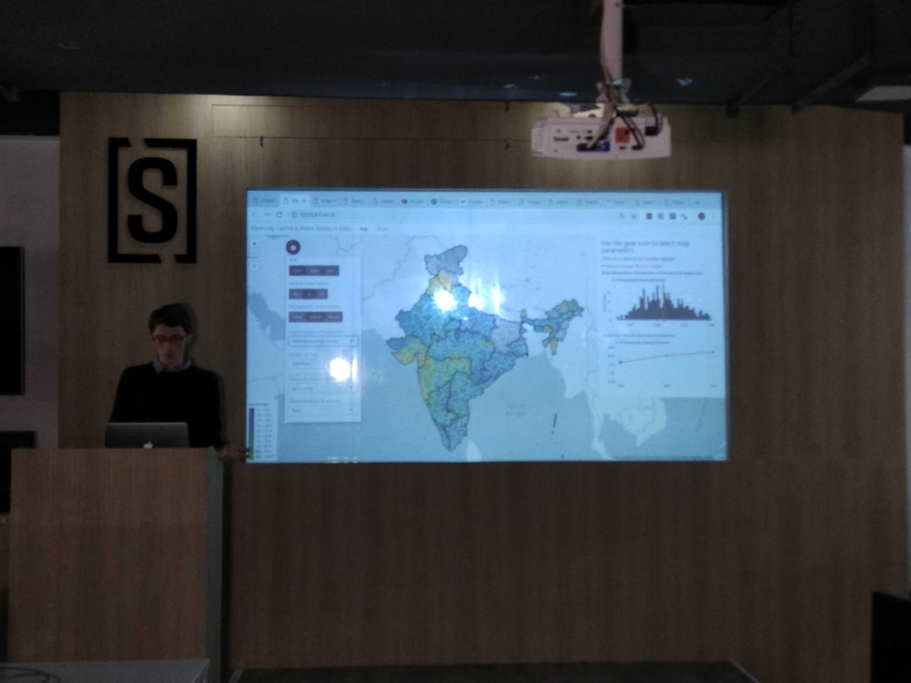
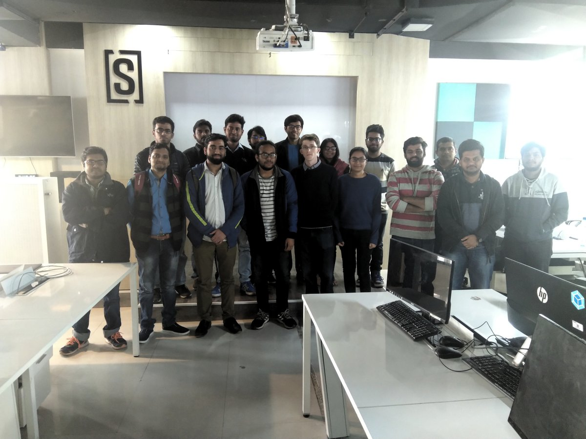

+++
title = "Shiny & Geospatial Visualization"
date = 2018-12-15T00:00:00  # Schedule page publish date.
draft = false

# Talk start and end times.
#   End time can optionally be hidden by prefixing the line with `#`.
time_start = 2018-12-15T11:30:00
time_end = 2018-12-15T12:30:00
all_day = false

# Authors. Comma separated list, e.g. `["Bob Smith", "David Jones"]`.
authors = []

# Abstract and optional shortened version.
abstract = "At the second R Users Delhi Meetup, I gave a talk on building interactive choropleths in R. In particular, I covered wrangling Census data with `tidyverse` tools, working with `sf` spatial dataframes, mapping in `leaflet`, and adding interactivity with `shiny`."
abstract_short = "Building an interactive choropleth with the `sf`, `leaflet` and `shiny` packages"

# Name of event and optional event URL.
event = "R Users Delhi Meetup"
event_url = "https://twitter.com/rusersdelhi"

# Location of event.
location = "Social Cops, New Delhi, India"

# Is this a featured talk? (true/false)
featured = false

# Projects (optional).
#   Associate this talk with one or more of your projects.
#   Simply enter your project's folder or file name without extension.
#   E.g. `projects = ["deep-learning"]` references 
#   `content/project/deep-learning/index.md`.
#   Otherwise, set `projects = []`.
projects = ["electricity-latrine"]

# Tags (optional).
#   Set `tags = []` for no tags, or use the form `tags = ["A Tag", "Another Tag"]` for one or more tags.
tags = ["sf", "leaflet", "shiny", "ggplot2"]

# Slides (optional).
#   Associate this talk with Markdown slides.
#   Simply enter your slide deck's filename without extension.
#   E.g. `slides = "example-slides"` references 
#   `content/slides/example-slides.md`.
#   Otherwise, set `slides = ""`.
slides = ""

# Links (optional).
url_pdf = ""
url_slides = ""
url_video = ""
url_code = ""

# Does the content use math formatting?
math = true

# Featured image
# To use, add an image named `featured.jpg/png` to your page's folder. 
[image]
  # Caption (optional)
  caption = "Image credit: **Social Cops**"

  # Focal point (optional)
  # Options: Smart, Center, TopLeft, Top, TopRight, Left, Right, BottomLeft, Bottom, BottomRight
  focal_point = "Center"
+++

A full report of the talk, including video and slides, can be found [here on the Social Cops blog](https://blog.socialcops.com/technology/data-science/shiny-electricity-latrine-water-india/).

The example shiny app itself can be found directly [here](https://shiny.socialcops.com/gisvector/).

Thanks to everyone who came out to the Meetup!

Image Credits: Social Cops
